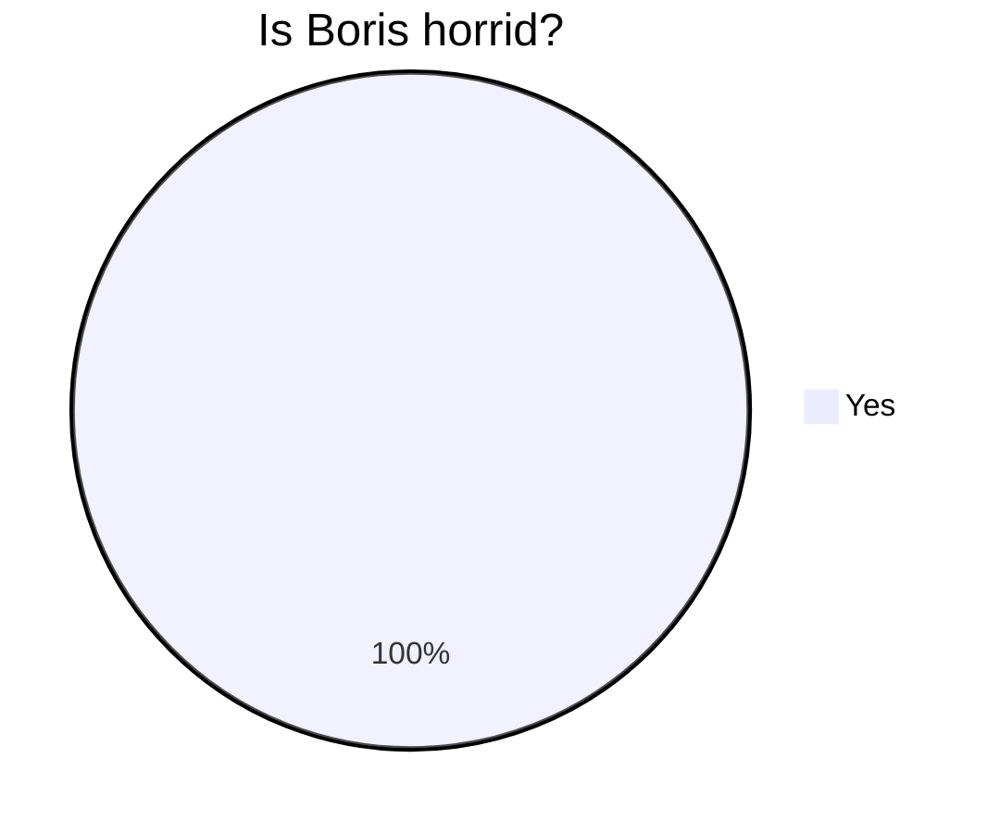

# My Example Website

Hello, this is my website. It's pretty cool, even if I do say so myself! It's just an example site I made with Typora.

[toc]


## Some facts about my site

* I made it as an example for a tutorial I was writing
* It was written using markdown
* I exported it to HTML with [Typora](https://typora.io/)
* It is hosted on github pages

## What kinda stuff can you have on a Typora site?

### Tables

| DaY       | Did I Procrastinate? |
| --------- | -------------------- |
| Monday    | yes                  |
| Tuesday   | yes                  |
| Wednesday | you get the idea     |

### Code blocks

```javascript
let exampleSite = true

let whatIsThis = () => {
	if (exampleSite) return "This is fuckin dope!"
    
    return "This is not dope. Not dope at all."
}


alert(whatIsThis())
```

### Maths

$$
\frac{1}{2} \times 3 \lt \frac{8}{3}
$$

### Quote

> Only from the heart can you touch the sky.
>
> ​		- Rumi

### Flowcharts


```flow
op=>operation: Flowchart
cond=>condition: Is this a flowchart?
e=>end


cond(yes)->op
cond(no)->e
```


### Pie Charts


